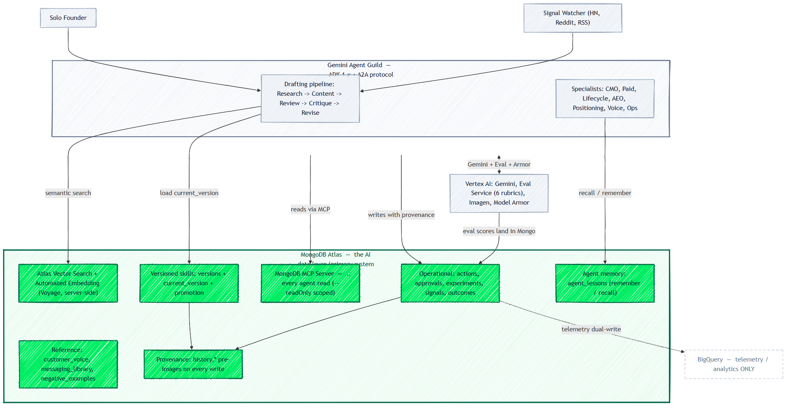
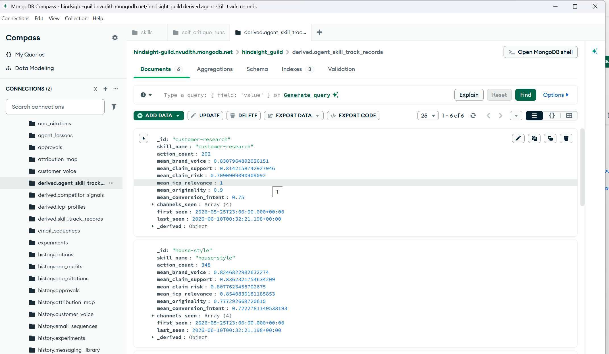
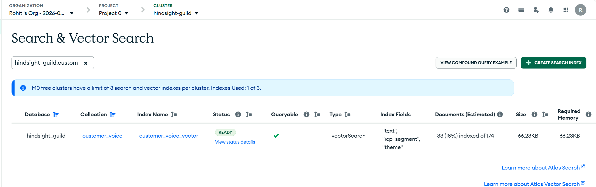

# Hindsight Guild

**A marketing team of one's own — that remembers, learns, and levels up.**
Built on Gemini 3 + Google Cloud Agent Builder + MongoDB Atlas.

🌐 **Live app:** <https://hindsight-guild.web.app> ·
▶ **3-min demo video:** <https://youtu.be/Ky3HB259tOc> ·
🏆 **Track:** MongoDB · 📄 Apache-2.0

Hindsight Guild is an autonomous marketing team for **solo founders**: a guild
of Gemini agents on Google Cloud Agent Builder that researches, drafts,
fact-checks, and routes content for approval — then **publishes for real**
(Dev.to, Substack, LinkedIn, Google Ads, Meta Ads) and learns from every
decision. Its memory, judgment, and learning all live in **MongoDB Atlas**,
queried live through the MongoDB MCP server. The team **remembers** what
worked (Atlas as the system of record, including agent memory in
`agent_lessons`), **learns** from what got rejected (rubric grounding on past
negatives), and **levels up** its own playbooks over time (versioned skills +
promotion gate).

**Why it matters:** a solo founder *is* the marketing department — and has no
time to be. Most "AI marketing" tools are a chatbot around a prompt: they
answer, they don't *act*, and they never get better. Hindsight Guild closes
the whole loop — signal → research → draft → review → human approval →
publish → outcome attribution → self-improvement — and the
remember/learn/level-up core generalizes to **any agent team that has to
learn from its own history**, far beyond marketing.

## See it work in 5 minutes

1. **Draft** ([live](https://hindsight-guild.web.app/draft)) — ask
   for a LinkedIn post. Watch the agent call the **MongoDB MCP server**
   (`mongodb_find`, `mongodb_aggregate`) and pull real customer quotes via
   **Atlas Vector Search with Automated Embedding** — plain text in, scored
   documents out, no client-side embedding code or key.
2. **Queue** — the draft arrives scored on six rubrics (Vertex AI Gen AI
   Evaluation Service), each grounded in *past rejections* stored in MongoDB.
   Reject it with a reason.
3. **Draft again** — the rejection is already a `negative_examples` row (with
   a provenance record + history pre-image), and the next similar draft is
   penalized for the same weakness. **The system changed its behavior from
   one row in MongoDB.**
4. **Learning / Weekly Review** — nightly miners turn edits, rejections, ad
   under-performance, and signal outcomes into proposed playbook revisions; a
   weekly promotion gate re-verifies them and the founder flips
   `current_version` with one click.
5. **Agents / Live** — the whole guild runs as 13 deployed Cloud Run services
   speaking the **Agent2Agent (A2A) protocol**, with Cloud Scheduler driving
   the weekly CMO cycle, nightly eval re-grades, and signal-triggered
   drafting.

Approving a draft **takes action**: blog posts publish to Dev.to, newsletters
to Substack, posts to LinkedIn, ad variants land in Google/Meta Ads (paused,
spend-safe), and email sequences persist to `email_sequences` + stage as
HubSpot drafts (never auto-sent) — then GA4/HubSpot/Ads outcomes flow back to
close the loop.

Built around real ADK 1.x multi-agent primitives, the Agent2Agent protocol,
Vertex AI Gen AI Evaluation Service, and Model Armor — with **MongoDB Atlas as
the primary store** (transactional + reference + memory + skills), reached
through the MongoDB MCP server, with vector search via Atlas **Automated
Embedding** (no client-side embedding API). BigQuery is used **only** for
telemetry/analytics.

It runs **lean** — a hard **cost cap** ($1k/mo at solo-founder scale), not a
permission to ship stubs.

## MongoDB-native architecture

**MongoDB Atlas is the AI data layer** — not a cache or a side store, but the
primary system of record the whole guild reasons over. BigQuery holds telemetry
only; everything operational, referential, remembered, and learned lives in
Atlas.



How every layer leans on the **MongoDB AI stack**:

| Capability | How Hindsight Guild uses it |
|---|---|
| **Atlas as primary store** | All transactional + reference data: `actions`, `approvals`, `experiments`, `signals`, `outcomes`, `customer_voice`, `messaging_library`, `negative_examples`. The approval queue, drafting, and skills all read Atlas first. |
| **MongoDB MCP Server** | **Every agent read goes through the MCP server** (`mongodb-mcp-server`, `--readOnly` for read-scoped agents) — the LLMs query Atlas as a first-class tool. Writes use the driver so `history.*` can capture provenance. |
| **Atlas Vector Search + Automated Embedding** | Semantic search over `customer_voice` with **Atlas-managed embeddings** (`autoEmbed`, Voyage model, server-side) — text in, results out, **no external embedding API or key**. Deliberately the *only* vector index: semantic retrieval where meaning matters (customer quotes), exact key lookups where precision is the contract (`messaging_library` by ICP+approved status, `negative_examples` by channel+category recency). The `<collection>_vector` naming convention in `mongodb_vector_search` means extending semantic retrieval to another collection is one `SearchIndexModel` block in `mongo/schema.py`. |
| **Agent memory** | The `agent_lessons` collection *is* the institutional memory — `remember_lesson` / `recall` per ICP, channel, campaign, and skill. (Replaces Vertex Memory Bank entirely.) |
| **Versioned skills + self-learning** | Skills live in Atlas as `versions{}` + `current_version`; the self-critique → promotion-gate → approval loop **mutates the active version in Mongo**, then reconciles `SKILL.md` from it. |
| **Provenance / history** | Every write captures a pre-image in `history.*` for time-travel and audit — the learning loop is fully traceable in Atlas. |

> BigQuery (`telemetry.*`) is **analytics-only** and read behind opt-in flags;
> the operational ground truth is always MongoDB.

**Proof in the console** — the live cluster, not a diagram:


*Every layer of the system is a collection: 22 canonical, a `history.*`
pre-image shadow for each (the audit trail), `derived.*` rollups the nightly
jobs recompute, and `agent_lessons` as agent memory. Open document: a
`derived.agent_skill_track_records` rollup with per-rubric means.*


*The `customer_voice_vector` index (type `vectorSearch`, autoEmbed on `text`
with `icp_segment`/`theme` as pre-filters — see `mongo/schema.py`) READY and
queryable on the live cluster. Atlas embeds documents at insert and query
text at search time; the index-fields column shows plain field names because
there is no client-side vector field at all.*

## How the agents work as a team

```
                    ┌─────────────────────────┐
                    │  CMO Planner (Mon)      │
                    │  uses AgentTool to call │
                    │  Analytics + Research,  │
                    │  drafts weekly memo,    │
                    │  posts to Slack         │
                    └────┬──────────┬─────────┘
                         │          │ AgentTool
                  ┌──────▼────┐ ┌───▼──────────┐
                  │ Analytics │ │  Research    │
                  │ (BQ q)    │ │  Agent       │
                  └───────────┘ └──────────────┘
                                       ▲
                                       │
SequentialAgent: Drafting pipeline (Tue)│
  ┌─────────┐    ┌─────────┐    ┌──────┴──┐
  │ Research│───▶│ Content │───▶│ Review  │
  └─────────┘    └─────────┘    └─────────┘
   writes         reads {research}        writes
   state['research_findings']  state['draft']  state['review']
                                            │
                            after_agent_callback
                                            │
                              Vertex AI Eval Service
                            (all 6 rubrics, sampled inline)
                                            │
                       telemetry dual-write: Mongo `actions`
                       (primary, operational) + BigQuery (analytics)
                                            │
                              ┌─────────────┼─────────────┐
                              ▼             ▼             ▼
                      eval_harness    drift_detect   self_critique
                      (nightly all-   (28d window   (weekly Gemini
                       rubric re-grade) drop → exp)  → playbook revs)
                              │             │             │
                              └─────────────┼─────────────┘
                                            ▼
                                    promotion_gate (weekly)
                                            │
                              raises promotion_request on skill
                              founder reviews → flips current_version
```

Every agent is exposed via **A2A** (`to_a2a()`), so Cloud Run jobs and external
callers invoke them as remote services — not Python imports. The diagram shows
the core weekly + drafting flow; the full guild also includes **Positioning**,
**Paid Media**, **Lifecycle Email**, **Customer Voice**, **Ops/QA**, **AEO**
(answer-engine optimization), and **ImageBrief** specialists, plus two
cross-cutting loops:

- **Signal-triggered drafting** — `signal_watcher` + `signal_router` turn
  inbound signals into draft requests routed to the right channel agent.
- **Closed-loop learning** — the drafting pipeline runs an inline
  Critique→Revise step before review; nightly miners + the weekly
  `self_critique` agent propose `SKILL.md` revisions that the
  `promotion_gate` re-verifies and the founder approves to flip
  `current_version`.

## Repo layout

```
hindsight-guild/
├── pyproject.toml                 # pinned deps incl. ADK 1.x, a2a-sdk, google-ads
├── setup.sh                       # GCP + APIs + Atlas + Firebase bootstrap (C0)
├── LOCAL_DEV.md                   # run the whole stack locally (Mongo + synthetic fallbacks)
├── docker-compose.yml             # local MongoDB
├── cloudbuild.yaml                # parallel image builds (16 images)
├── firebase.json / .firebaserc    # Firebase Hosting: SPA + /api,/media rewrites → web-api
├── .github/workflows/
│   ├── ci.yml                     # ruff + pytest(unit) + web build, on push/PR
│   └── deploy.yml                 # manual, keyless (WIF) deploy of the whole stack
├── deploy/                        # phased manual deploy scripts — see deploy/README.md
│   ├── all.sh / env.sh            # orchestrator + shared SA/image/job/schedule maps
│   ├── 01-build-images.sh         # cloudbuild.yaml submit
│   ├── 02-deploy-services.sh      # web-api + 13 A2A + HTTP handlers
│   ├── 03-deploy-jobs.sh          # 11 Cloud Run jobs
│   ├── 04-schedulers.sh           # 11 Cloud Scheduler triggers
│   ├── 05-deploy-ui.sh            # build SPA → Firebase Hosting
│   └── 06-bind-iam.sh             # cross-service IAM
├── docs/
│   ├── DEPLOYMENT.md              # one-time pre-setup checklist + deploy guide
│   └── prds/                      # product specs (AEO, signal-drafting, closed-loop)
├── sql/schema.sql                 # 3 BQ tables + 3 views (C1)
├── mongo/
│   ├── schema.py                  # 15 canonical collections + history.* + derived.* + autoEmbed vector index
│   ├── seed.py                    # back-compat shim → `python -m mongo.schema apply`
│   ├── mcp_server.py              # MongoDB MCP server launcher (RO/RW) — reads go through MCP
│   └── history.py / queries.py    # provenance + pre-image capture; query helpers
├── shared/
│   ├── telemetry.py               # dual-writer: Mongo `actions` (primary) + BigQuery (analytics)
│   ├── rubrics.py                 # Vertex AI Eval Service, all 6 rubrics + quality floor
│   ├── mongo_tools.py             # pymongo helpers (RO/RW secret routing) — write path (provenance)
│   ├── clients.py                 # lazy BQ/secret clients (LOCAL_DEV fallbacks)
│   ├── skills.py                  # skill registry + read_skill tools + Mongo→disk reconcile
│   ├── memory.py                  # agent memory in MongoDB `agent_lessons` (remember_lesson/recall)
│   ├── diagrams.py                # mermaid-renderer client → infographic/excalidraw image assets
│   ├── allocator.py / provenance.py / bigquery_helper.py / imagen.py
│   └── integrations/              # GA4 / HubSpot / Google Ads / LinkedIn clients
├── prompts/                       # versioned prompt templates per playbook
├── agents/                        # ADK agents — every one exposed via A2A (to_a2a)
│   ├── pipeline.py                # SequentialAgent(Research→Content→Review→Critique→Revise)
│   ├── research/content/review/analytics/cmo_planner.py  # core drafting + weekly CMO cycle
│   ├── positioning/paid_media/lifecycle_email/customer_voice/ops_qa/image_brief/aeo_agent.py
│   ├── signal_router.py / signal_watcher.py              # signal-triggered drafting
│   ├── self_critique.py / self_critique_runner.py / _miners/   # closed-loop learning
│   ├── critique.py / reviser.py / finalizer.py           # inline critique → revise loop
│   ├── a2a_server.py / a2a_client.py                     # A2A exposure + worker client
│   ├── _factory.py _models.py _prompts.py _mcp.py _mongodb_tools.py _skills_config.py _schema_constants.py
│   └── cmo_planner_visual/        # Agent Designer YAML (demo variant; not a Python package)
├── services/                      # Cloud Run jobs + HTTP services
│   ├── web_api/                   # FastAPI — the UI's /api backend (public)
│   ├── outcome_attach/            # GA4 + HubSpot + Google Ads + LinkedIn attribution
│   ├── eval_harness/              # nightly all-6-rubric re-grade
│   ├── derive_track_records/ drift_detect/              # rubric rollups + 28d drift → exp
│   ├── self_critique/ promotion_gate/ positioning_review/   # weekly learning + gates
│   ├── paid_media_sweep/ ops_qa_sweep/ snapshot_mongo/
│   ├── substack_publisher/ substack_publish_sweep/      # publishing + stuck-publish retry
│   ├── edit_capture_handler/      # Gemini edit classifier (approval Sheet → handler)
│   ├── mermaid_renderer/          # Node + mmdc + headless chromium → diagram-as-code PNGs
│   └── slack_approval_handler/
├── skills/                        # versioned SKILL.md playbooks (house-style, aeo, …)
├── web/                           # React + Vite SPA — the public website (Firebase Hosting)
│   ├── src/                       # routes, components, lib/api.ts (same-origin /api)
│   └── package.json               # build → dist/
├── apps_script/Code.gs            # approval Sheet → edit-capture-handler sync
├── scripts/
│   ├── create_agent_identity.sh / create_mongo_users.sh / create_model_armor_template.sh
│   └── setup_github_wif.sh        # one-time Workload Identity Federation for CI deploy
├── dashboards/README.md           # Looker Studio build steps
├── demo/                          # seed_demo + run_pipeline / run_cmo_planner / run_research
└── tests/{unit,integration,e2e}/
```

## No stubs — the hard parts are real

Every component below started life as the easy version; each was rebuilt on
the real primitive:

| Component | Was | Now |
|---|---|---|
| Multi-agent team | 4 independent agents | SequentialAgent pipeline + AgentTool composition |
| Cross-agent calls | Python imports | A2A protocol via `to_a2a()` |
| Agent memory | Vertex AI Memory Bank (Agent Engine dep) | MongoDB `agent_lessons` — `remember_lesson`/`recall`, no Agent Engine |
| Mongo access | direct pymongo everywhere | MCP server for agent reads; pymongo for writes (provenance capture) |
| Vector search | client-side embedding + Voyage key | Atlas **Automated Embedding** (`autoEmbed`), no client embed code/key |
| Rubric harness | 2 hand-rolled Gemini calls | Vertex AI Eval Service, all 6 PointwiseMetric rubrics + golden-set regression gate |
| Self-learning loop | inline 2-rubric scoring only | nightly all-6-rubric re-grade (`eval_harness`) + weekly `promotion_gate` |
| HubSpot / GA / LI handlers | `return None` | Real REST + GAQL + BQ-export queries with tenacity retry |
| Edit classifier | regex heuristic | Gemini structured output (LIGHT tier) |
| Model Armor | template only | floor settings + VERTEX_AI integration + template binding |
| Analytics agent | absent | Real LlmAgent used by CMO via AgentTool |
| DECISIONS.md | created unilaterally | removed |

## Run order

> **Deploying to GCP via CI?** See **`docs/DEPLOYMENT.md`** for the recommended
> path: a one-time pre-setup checklist, then a manual, keyless GitHub Actions
> deploy (`.github/workflows/deploy.yml`, Workload Identity Federation) that
> runs all of the below for you and publishes the UI to Firebase Hosting. The
> manual scripts here remain the source of truth that workflow orchestrates.
>
> To run the whole thing **locally** (Dockerized Mongo + synthetic fallbacks,
> no cloud creds), see **`LOCAL_DEV.md`**.

```bash
cd hindsight-guild
export PROJECT_ID=hindsight-guild-mvp REGION=us-central1 BILLING_ACCOUNT=<id>

./setup.sh                                # GCP project, APIs (incl. Firebase), Atlas M0, secrets
./scripts/create_mongo_users.sh           # RO + writer Atlas users → Secret Manager
./scripts/create_agent_identity.sh        # sa-agents + sa-scheduler
./scripts/create_model_armor_template.sh  # floor + template + binding
python mongo/seed.py                      # collections + vector index

./deploy/all.sh                           # 16 images, 17 services, 11 jobs, 13 schedulers,
                                          # IAM, + UI → Firebase Hosting
                                          # (see deploy/README.md for per-phase control)

# Agent memory needs no extra setup — it lives in MongoDB (`agent_lessons`),
# created by the schema step above. (No Agent Engine / AGENT_ENGINE_ID.)

# Manual:
#   - Build approval Sheet + paste Apps Script per apps_script/README.md.
#     Sheet header (row 1) must be:
#        telemetry_id | channel | original_draft | approved_text |
#        decision | rejection_reason | decided_by | decided_at | synced
#   - In the Apps Script editor: File → Project properties → Script
#     properties → add HANDLER_URL = <edit-capture-handler Cloud Run URL>/handle
#     (no more code edits per deploy — getHandlerUrl_() reads this).
#   - Populate slack_webhook_url secret (until then, slack_approval logs
#     'webhook_unconfigured' and returns successfully without notifying).
#   - Build Looker dashboard per dashboards/README.md
#   - Open the public site: https://<PROJECT_ID>.web.app (Firebase Hosting).
#     Add a custom domain later in the Firebase console → Hosting.

python demo/seed_demo.py                  # 30 days of state, run 60+ min before demo

# Drafting via the SequentialAgent pipeline
python demo/run_pipeline.py --icp seg_revops_director --channel linkedin

# Weekly CMO cycle
python demo/run_cmo_planner.py
```

## Testing

```bash
pip install -e ".[dev]"
ruff check .                      # lint (also the CI gate)
pytest tests/unit -q              # mocked; no cloud creds needed
INTEGRATION_TEST=1 pytest tests/integration -q   # against live cloud
python -m tests.e2e.e2e_smoke     # end-to-end drivers (need a running stack; see tests/e2e/)
```

**Eval golden set** (`tests/golden/`) — a curated corpus of unambiguously
good/bad drafts with expected score bands. `tests/unit/test_eval_golden.py`
runs cloud-free in CI and guards the *harness contract* (rubric names, 1-5→0..1
normalization, the `passes_quality_floor` ship/hold gate);
`tests/integration/test_eval_golden_live.py` (under `INTEGRATION_TEST=1`) runs
the same corpus through the **real** Vertex judge as the judge-drift gate. Add a
clear-cut draft + the rubric it sharply exercises to extend coverage.

The headline integration test is `tests/integration/test_reject_then_redraft.py`:
inject a fresh negative, re-score similar drafts, confirm the rubric grounding
picks up the new negative and lowers scores on like patterns. The A2A handshake
test verifies cross-agent calls work over the protocol. `tests/e2e/` holds
full-loop drivers (smoke, agent handoffs, PRD features, memory tiers,
skill-evolution) that exercise the live API + agents.

## Conventions

- **Region:** `us-central1`. Atlas colocated.
- **Models:** two tiers, resolved centrally in `shared/models.py` (`HEAVY` for Content, CMO Planner, Lifecycle Email, Positioning, Paid Media, Self-Critique, Reviser; `LIGHT` for Research, Review, Analytics, Ops/QA, Customer Voice, ImageBrief, Critique, rubric judge, edit classifier). Agents name a tier, never a model. **This deployment runs Gemini 3: `gemini-3.5-flash` on the heavy tier and `gemini-3.1-flash-lite` on the light tier** (see `deploy/env.sh`). Retarget either tier with `MODEL_HEAVY` / `MODEL_LIGHT`, no code change. Agents call Gemini via the **paid Developer API** (Gemini 3 isn't served on this project's Vertex AI); the **rubric judge is the one exception** — the Vertex AI Eval Service can't switch backends, so it's pinned via `JUDGE_MODEL` to `gemini-2.5-flash-lite`.
- **Secrets:** Never in code. All in Secret Manager.
- **Data stores:** MongoDB Atlas is the **primary store** for transactional, reference, memory (`agent_lessons`), and skill data. BigQuery holds **telemetry/analytics only** (event log + derived views); operational reads default to Mongo (BQ behind opt-in flags).
- **Mongo access:** Agent **reads** go through the MongoDB **MCP server** (`mongodb-mcp-server`, `--readOnly` for read-scoped agents); **writes** use pymongo so `mongo/history.py` can capture pre-images + provenance. Content + Review use `mongo_uri_readonly`; Research, CMO, workers use `mongo_uri_writer`. Atlas enforces server-side; falls back to pymongo if the MCP subprocess can't launch.
- **Vector search:** Atlas **Automated Embedding** (`autoEmbed`, `voyage-4-lite` managed server-side) on `customer_voice`. No client-side embedding code and no Voyage API key. Runs on the M0 free tier in this deployment, but the preview's embedding quota is tight — bulk inserts can rate-limit query-time embedding for a while (the tool then falls back to a field-filter `find()`; `scripts/preflight_demo.py` verifies real `$vectorSearch` before a demo).
- **Telemetry:** Every agent emits one row to Mongo `actions` (+ BigQuery `telemetry.actions`) via `after_agent_callback`. Outcome slots created at the same time, filled async by `services/outcome_attach`.
- **Eval:** All 6 rubrics live, inline at draft time (Eval Service, sampled via `EVAL_SAMPLE_RATE`) + nightly all-6 re-grade by `eval_harness`. A curated **golden set** (`tests/golden/`) guards the harness contract in CI (cloud-free) and the live judge under `INTEGRATION_TEST=1`; `rubrics.passes_quality_floor` is the opt-in ship/hold gate (`EVAL_QUALITY_FLOOR`).
- **Skills:** Versioned in Mongo (`skills.versions{}` + `current_version`); the self-critique → promotion-gate → founder-approval loop flips the active version, and `read_body()` reconciles the on-disk `SKILL.md` from Mongo.
- **Cost cap:** ~$1k/mo at solo-founder scale (Cloud Run scales to zero, Atlas
  M0 free tier; spend is mostly Cloud Build minutes + Vertex AI tokens).

## Caveats — read before deploying

- **ADK 1.x API drift:** Pinned versions in `pyproject.toml`. If `to_a2a` import path or `LlmAgent.output_key` shape differs in your install, see referenced docs.
- **MongoDB MCP server needs Node:** The agent image ships Node + `mongodb-mcp-server` so reads run over MCP. Without Node (e.g. a bare dev laptop), agents fall back to pymongo automatically (`MONGODB_USE_MCP=0` forces it). Deployed agents set `MONGODB_REQUIRE_MCP=1` (deploy default), which **forbids** that silent fallback — a broken MCP launch fails loudly instead.
- **Atlas Automated Embedding quota:** `autoEmbed` is public preview and works on this deployment's M0 free tier, but the embedding provider rate-limits aggressively — a bulk insert into the indexed collection can exhaust the quota and temporarily break query-time embedding too (observed ~75-min recovery). `mongodb_vector_search` falls back to a field-filter `find()` on errors; run `scripts/preflight_demo.py` before anything that depends on live vector search.
- **Vertex AI Eval Service usage:** Counted toward your project quota. Synchronous calls at draft time are sampled (`EVAL_SAMPLE_RATE`, default 0.25) + nightly batch; the live golden-set test (`INTEGRATION_TEST=1`) also spends quota (~6 calls/draft).
- **Model Armor flag drift:** Floor-settings + template binding flags may differ slightly across `gcloud` versions. Verify against the docs linked in `scripts/create_model_armor_template.sh`.
- **A2A service auth:** Deployed with `--no-allow-unauthenticated`. Configure caller IAM bindings (`gcloud run services add-iam-policy-binding`) so workers can invoke agents.
