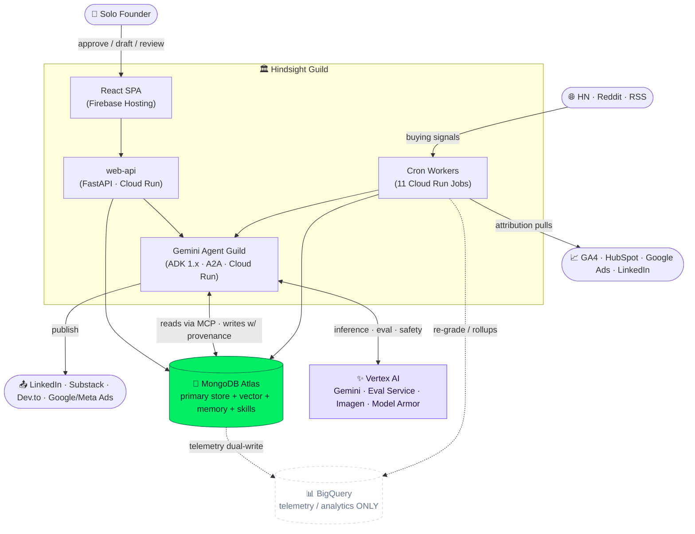
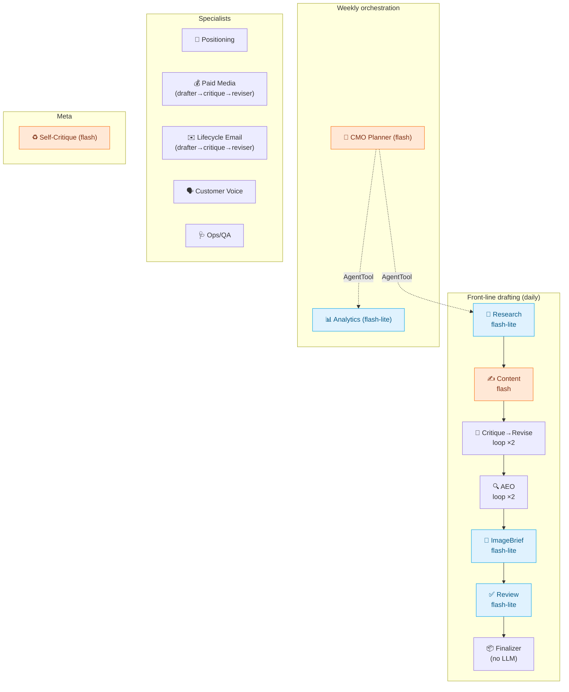
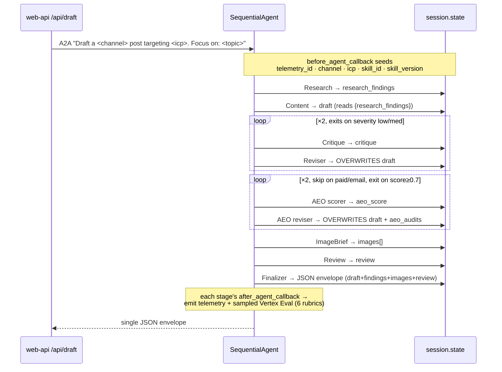
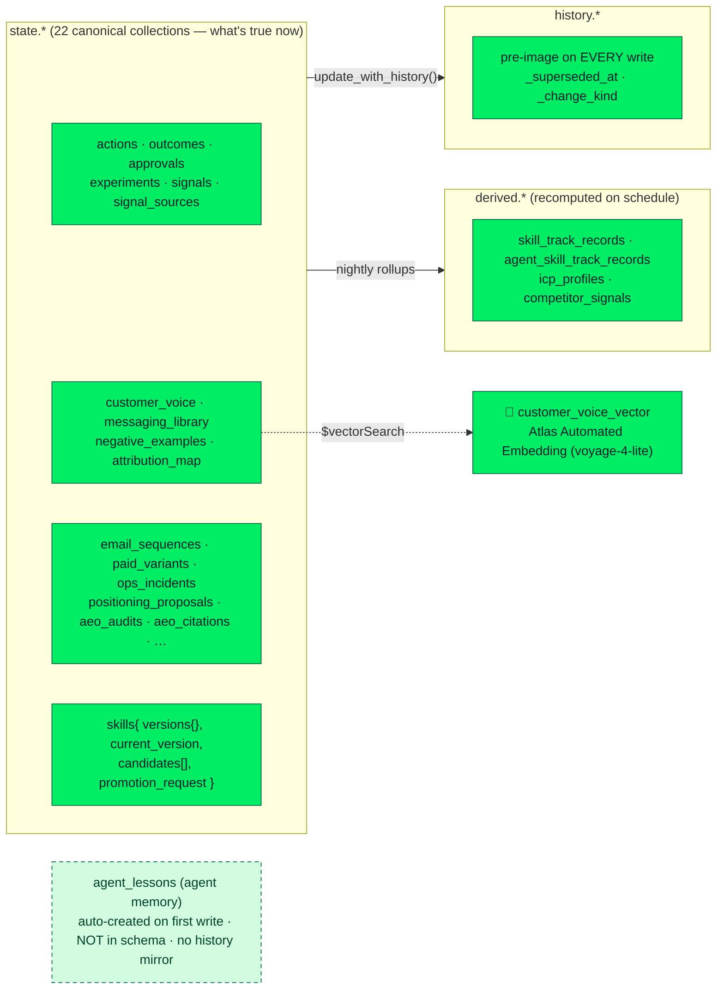
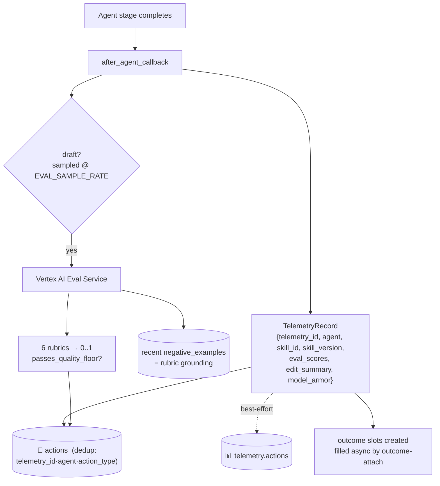
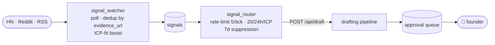
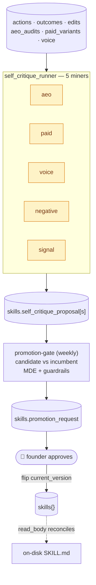
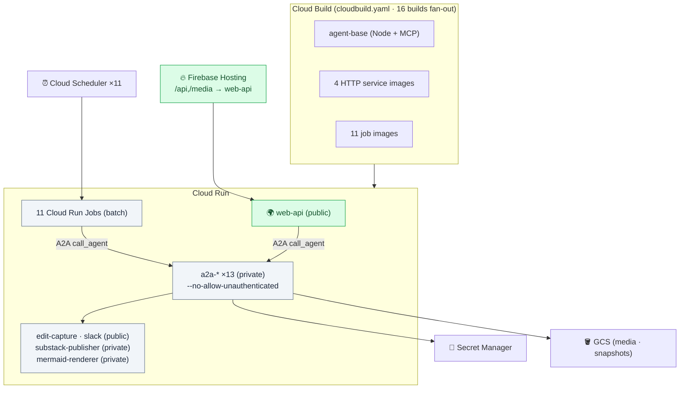
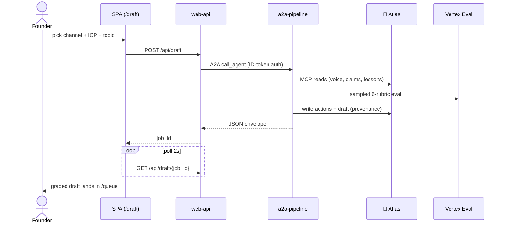
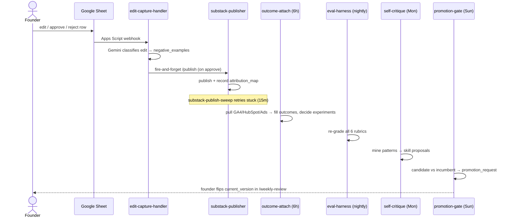

# Hindsight Guild — Architecture (Reverse-Engineered)

> **A marketing team of one's own — that remembers, learns, and levels up.**
> A guild of Gemini agents (Google Cloud / ADK 1.x + A2A) that researches, drafts,
> fact-checks, and routes content for founder approval — then learns from every
> decision. **MongoDB Atlas is the primary system of record** (transactional +
> reference + memory + skills), reached through the MongoDB MCP server.
> **BigQuery is analytics-only.**

This document is a visual, reverse-engineered map of the codebase. It complements
the prose in [`../README.md`](../README.md) and the deploy guide in
[`DEPLOYMENT.md`](./DEPLOYMENT.md).

---

## Table of contents

1. [System context (C4 L1)](#1-system-context-c4-level-1)
2. [The five layers](#2-the-five-layers)
3. [The agent guild](#3-the-agent-guild)
4. [The drafting pipeline](#4-the-drafting-pipeline)
5. [MongoDB — the AI data layer](#5-mongodb--the-ai-data-layer)
6. [The 4-layer memory model](#6-the-4-layer-memory-model)
7. [Telemetry + evaluation](#7-telemetry--evaluation)
8. [The three closed loops](#8-the-three-closed-loops)
9. [Deployment topology](#9-deployment-topology)
10. [Scheduled workers (cron map)](#10-scheduled-workers-cron-map)
11. [Frontend SPA](#11-frontend-spa)
12. [End-to-end runtime flows](#12-end-to-end-runtime-flows)
13. [Cross-cutting concerns](#13-cross-cutting-concerns)
14. [Repository map](#14-repository-map)

---

## 1. System context (C4 Level 1)

Who talks to the system, and what it leans on.



**One-line mental model:** the founder is a *reviewer*, not an author. The guild
initiates (signals), drafts (pipeline), grades itself (rubrics), waits for a yes/no
(approval queue), publishes, attributes outcomes, and rewrites its own playbooks —
all with MongoDB as the ground truth and a hard **~$1k/mo** cost cap.

---

## 2. The five layers

```
┌──────────────────────────────────────────────────────────────────────────┐
│  ① PRESENTATION         React + Vite SPA · 12 routes · TanStack Query      │
│                         Firebase Hosting  →  /api,/media rewrites           │
├──────────────────────────────────────────────────────────────────────────┤
│  ② API / EDGE           web-api (FastAPI) — 15 routers, the ONLY public    │
│                         backend.  edit-capture · slack · substack handlers │
├──────────────────────────────────────────────────────────────────────────┤
│  ③ AGENT GUILD          13 ADK agents, each exposed over A2A (to_a2a)      │
│        ┌─────────────┐  Drafting pipeline (SequentialAgent) + specialists  │
│        │ pipeline    │  CMO · Positioning · Paid · Lifecycle · Voice ·     │
│        │ specialists │  Ops/QA · AEO · ImageBrief · Self-Critique          │
│        └─────────────┘                                                      │
├──────────────────────────────────────────────────────────────────────────┤
│  ④ LEARNING / OPS       11 Cloud Run Jobs on Cloud Scheduler:              │
│                         eval-harness · derive-track-records · drift-detect  │
│                         self-critique · promotion-gate · outcome-attach …   │
├──────────────────────────────────────────────────────────────────────────┤
│  ⑤ DATA PLANE           🍃 MongoDB Atlas (primary) ── state · history ·    │
│                            derived · vector · agent_lessons · skills        │
│                         📊 BigQuery (telemetry/analytics only)              │
│                         ✨ Vertex AI · Secret Manager · GCS (media/snaps)   │
└──────────────────────────────────────────────────────────────────────────┘
        shared/  — the spine every layer imports:
        telemetry · rubrics · mongo_tools · memory · skills · provenance ·
        diagrams · allocator · clients · integrations/
```

Key invariant: **agent reads go through the MongoDB MCP server; writes go through
pymongo** so `mongo/history.py` can capture a pre-image + provenance on every
mutation. (`MONGODB_USE_MCP=0` forces the pymongo fallback when Node is absent.)

---

## 3. The agent guild

13 agents, every one is an ADK agent exposed as a remote service via
`to_a2a()` (`agents/a2a_server.py`). Cross-agent calls are **A2A JSON-RPC over
HTTP**, never Python imports.



| Agent | ADK type | Model | Writes (`output_key`) | Notable tools |
|---|---|---|---|---|
| **Research** | `LlmAgent` | flash-lite | `research_findings` | MCP read, vector search, `recall`, web_search |
| **Content** | `LlmAgent` | flash | `draft` | MCP read, skill tools |
| **Critique / Reviser** | `LlmAgent` ×2 in `LoopAgent` | flash-lite / flash | overwrites `draft` | (state only) |
| **AEO scorer / reviser** | `LoopAgent` | flash-lite | overwrites `draft`, `aeo_audits` | content_quality, passage_blocks (`scripts/aeo/*`) |
| **ImageBrief** | `LlmAgent` | flash-lite | `images[]` | imagen_generate, diagram_generate, image-safety check |
| **Review** | `LlmAgent` | flash-lite | `review` | evidence_validator, web_search |
| **Finalizer** | `BaseAgent` (no LLM) | — | JSON envelope | persists lesson to `agent_lessons` |
| **CMO Planner** | `LlmAgent` | flash | `weekly_plan` | `AgentTool(Research)`, `AgentTool(Analytics)`, slack_approval |
| **Analytics** | `LlmAgent` | flash-lite | `analytics_snapshot` | bigquery_query (no Mongo) |
| **Positioning** | `LlmAgent` | flash | `positioning_proposals` | evidence_validator, web_search |
| **Paid Media** | `SequentialAgent` | flash | `paid_variants` (after critique) | evidence_validator |
| **Lifecycle Email** | `SequentialAgent` | flash | `email_sequences` | skill tools |
| **Customer Voice** | `LlmAgent` | flash-lite | `customer_voice` docs | MCP write (autoEmbed) |
| **Ops/QA** | `LlmAgent` | flash-lite | `ops_scan` | http_health_check, utm_parse |
| **Self-Critique** | `LlmAgent` | flash | skill proposals | bigquery_query, `propose_skill_revision` |

> **Models** — `gemini-3.5-flash` (heavy: Content, CMO, Email, Positioning, Paid,
> Reviser, Self-Critique) vs `gemini-3.1-flash-lite` (cost-efficient: Research,
> Review, Analytics, Ops, Voice, ImageBrief, Critique, rubric judge, edit classifier).
> Selection lives in `agents/_models.py::pick_model`.

The **drafter → critique → reviser** split is a reusable pattern
(`agents/_critique_factory.py`): the drafter assembles in state but does **not**
persist; the reviser persists to Mongo **only after** the critique approves. The
factory is reused by Paid Media and Lifecycle Email.

---

## 4. The drafting pipeline

`agents/pipeline.py` — a `SequentialAgent` of 7 stages. State flows through
ADK `output_key` + `{template_variable}` substitution.



ASCII view of the state machine (what each stage reads vs. writes):

```
                  reads                          writes / output_key
  Research        customer_voice, lessons   ──▶  research_findings
  Content         {research_findings}       ──▶  draft
  Critique        {draft},{research},{topic}──▶  critique{severity}
  Reviser         {draft},{critique}        ──▶  draft   (OVERWRITE)
  AEO scorer      {draft}                   ──▶  aeo_score{sub_signals}
  AEO reviser     {draft},{aeo_score}       ──▶  draft   (OVERWRITE) + aeo_audits
  ImageBrief      {draft},{channel}         ──▶  images[]
  Review          {draft},{images},{research}──▶ review{flags}
  Finalizer       ALL of the above          ──▶  JSON envelope  +  agent_lessons
```

Two cleverness points worth calling out:

- **The Finalizer (a non-LLM `BaseAgent`)** exists because A2A's response surface
  only carries the *last* sub-agent's text. Without it, upstream slots (`draft`,
  `research_findings`, `images`) would be unreachable by the caller.
- **Skill A/B rollout** — `_resolve_skill_version_and_body` hashes `telemetry_id`
  into a bucket; `SKILL_CANDIDATE_ROLLOUT_PCT > 0` deterministically routes a slice
  of traffic onto a skill's candidate version, feeding the promotion gate the
  candidate-vs-incumbent telemetry it needs.

---

## 5. MongoDB — the AI data layer

MongoDB Atlas is **the primary store**, not a cache. `mongo/schema.py` declares
**22 canonical collections**, the `history.*` mirror (one per canonical collection),
the 4 `derived.*` rollups, and the `autoEmbed` vector index.



> **Note:** `agent_lessons` (Layer-4 episodic memory, §6) is written by
> `shared/memory.py` and **auto-created by MongoDB on first insert** — it is *not*
> in `schema.py::COLLECTIONS`, so unlike the 22 canonical collections it has **no
> `history.*` pre-image mirror** and no provenance indexes.

**Access rules (the heart of the design):**

```
        ┌─────────── AGENT READS ───────────┐      ┌────── AGENT WRITES ──────┐
        │  MongoDB MCP server (--readOnly)   │      │  pymongo via shared/      │
        │  find · aggregate · count · vector │      │  mongo_tools + history.py │
        │  LLM queries Atlas as a tool       │      │  captures pre-image +     │
        │  Content/Review → mongo_uri_readonly│     │  _provenance, supersedes  │
        │  Research/CMO   → mongo_uri_writer  │     │  chain                    │
        └────────────────────────────────────┘      └───────────────────────────┘
              falls back to pymongo if Node/MCP subprocess can't launch
```

Every document carries a `_provenance` block (`kind`, `actor_id`, `source`,
`confidence`, `trust_tier ∈ {verified, inferred, hypothesis, stale}`, `supersedes[]`)
plus `_workspace` and `_owner` — defined in `shared/provenance.py`, enforced on
write by `mongo/history.py`. `history.py::get_at()` reconstructs any document's
state at an arbitrary timestamp (time-travel/audit).

---

## 6. The 4-layer memory model

From `mongo/MEMORY_ARCHITECTURE.md` — the discipline that keeps "what happened"
separate from "what's true now" from "what we've learned."

```
   ┌────────────────────────────────────────────────────────────────┐
   │ Layer 4 · EPISODIC MEMORY      agent_lessons  (MongoDB)          │  ← remember_lesson / recall
   │   scope: icp:* · channel:* · campaign:* · skill:*               │     per ICP / channel / campaign
   ├────────────────────────────────────────────────────────────────┤
   │ Layer 3 · DERIVED STATE        derived.*  +  BQ views            │  ← recomputed nightly/weekly
   │   skill_track_records · icp_profiles      (freshness SLA, stale) │     from canonical + event log
   ├────────────────────────────────────────────────────────────────┤
   │ Layer 2 · CANONICAL STATE      state.*  +  history.*  (MongoDB)  │  ← versioned, provenance,
   │   "what is true now"           never overwritten w/o history     │     never lossy
   ├────────────────────────────────────────────────────────────────┤
   │ Layer 1 · EVENT LOG            BigQuery  (append-only, forever)  │  ← immutable source of truth
   │   telemetry.actions · outcomes · training.edits                 │     partitioned by ts
   └────────────────────────────────────────────────────────────────┘
        ▲ rebuild upward                              promote downward ▼
```

- **Memory** (`shared/memory.py`): `remember_lesson(scope, lesson)` inserts into
  `agent_lessons`; `recall(scope, query, top_k)` keyword-scores recent rows by
  relevance + recency. Non-raising — memory must never block a run. (This *replaces*
  Vertex AI Memory Bank entirely.)

---

## 7. Telemetry + evaluation

Every agent emits exactly one row per action via `after_agent_callback`
(`agents/_common.py`), written by `shared/telemetry.py::emit_action` as a **dual
write**: MongoDB `actions` first (primary/operational), then BigQuery
`telemetry.actions` (best-effort, never raises).



**The 6 rubrics** (`shared/rubrics.py`, judge = `gemini-3.1-flash-lite`):

| Rubric | Checks | Quality floor? |
|---|---|---|
| `brand_voice` | concise · evidence-led · not overclaiming | ✅ gating |
| `claim_support` | grounded in approved claims / voice | ✅ gating |
| `claim_risk` | legal safety · category-appropriate | ✅ gating |
| `icp_relevance` | persona signals · non-generic | ✅ gating |
| `originality` | distinct voice · non-recycled | tracked |
| `conversion_intent` | soft CTA · not hard-sell | tracked |

Scores normalize Vertex's 1–5 to 0..1. `passes_quality_floor` (default 0.5, env
`EVAL_QUALITY_FLOOR`) is the ship/hold gate over the four gating rubrics. Inline
eval is **sampled** (`EVAL_SAMPLE_RATE`, default 0.25); the nightly `eval-harness`
re-grades **all 6** on yesterday's drafts against the current judge. A golden set
(`tests/golden/`) guards the harness contract in CI and the live judge under
`INTEGRATION_TEST=1`.

---

## 8. The three closed loops

Three PRD-driven loops sit on top of the base pipeline (`docs/prds/`).

### Loop A — Signal-triggered drafting (PRD-02)

The system *initiates* instead of waiting for the founder to click "draft."



### Loop B — Answer Engine Optimization (PRD-01)

In-pipeline `LoopAgent` makes drafts citable by ChatGPT / Perplexity / AI Overviews
on blog/substack/linkedin (skipped on paid + email).

```
   draft ──▶ AEO scorer ──▶ score≥0.7 ? ──yes──▶ exit (keep draft)
              (content_quality        │
               + passage_blocks)      └─no──▶ AEO reviser
                                               (H2→questions, consolidate
                                                blocks, reorder) ──▶ loop ×2
                                               writes aeo_audits  ─────────┐
                                                                          ▼
                                              (later mined by aeo_miner for skill bullets)
```

### Loop C — Closed-loop learning (PRD-03)

Nightly/weekly miners read telemetry + outcomes, propose `SKILL.md` revisions; the
promotion gate re-verifies; the founder approves the version flip.



Miners are **pure functions** that return `Proposal` dicts — they never write Mongo
directly; the runner persists. Drift detection (`drift-detect`) opens investigation
experiments when a 28-day rubric window drops, feeding the same gate.

---

## 9. Deployment topology

16 container images built in parallel by Cloud Build → Artifact Registry
(`agent-base` + 11 job images + 4 HTTP-service images), deployed to Cloud Run.
Keyless deploy via GitHub Actions + Workload Identity Federation. (`mermaid-renderer`
ships its own Dockerfile and is built/deployed outside the `cloudbuild.yaml` fan-out.)



**Service inventory:**

| Kind | Components | Auth |
|---|---|---|
| Public web | Firebase Hosting (SPA), `web-api` | public |
| Private agents | `a2a-{research,content,review,analytics,pipeline,cmo,positioning,customer-voice,lifecycle-email,paid-media,ops-qa,self-critique,image-brief}` | IAM (`sa-agents` invoker) |
| Handlers | `edit-capture-handler`, `slack-approval-handler` (public); `substack-publisher`, `mermaid-renderer` (private) | mixed |
| Jobs | 11 Cloud Run Jobs (§10) | Scheduler OAuth (`sa-scheduler`) |

**Deploy pipeline** (`deploy/all.sh`, mirrored by `.github/workflows/deploy.yml`):

```
01-build-images ─▶ 02-deploy-services ─▶ 03-deploy-jobs ─▶ 04-schedulers ─▶ 06-bind-iam ─▶ 05-deploy-ui
   (cloudbuild)      (web-api+A2A+        (11 jobs)         (11 crons)       (cross-svc)    (SPA→Firebase)
                      handlers)
```

CI (`ci.yml`) runs `ruff` + `pytest tests/unit` + web build on every push/PR.
Deploy (`deploy.yml`) is manual (`workflow_dispatch`), keyless via WIF.

---

## 10. Scheduled workers (cron map)

11 Cloud Run Jobs wired to Cloud Scheduler (`deploy/env.sh`). The nightly chain is
intentionally ordered: re-grade → roll up → detect drift → audit ops.

```
   TIME (UTC)     JOB                     DOES                              WRITES
   ──────────     ───                     ────                              ──────
   every 6h       outcome-attach          fill outcome slots from           experiments,
                                          GA4/HubSpot/Ads/LinkedIn          BQ outcomes
   every 6h :30   paid-media-sweep        A2A→Paid; pause losers            paid_variants,
                                          open stop-loss incidents          ops_incidents
   every 15m      substack-publish-sweep  retry stuck publishes             approvals
   hourly         snapshot-mongo          dump state.* → GCS (M0 safety)    gs://…-snapshots
   ╔═══ nightly chain ═══════════════════════════════════════════════════════════════╗
   ║ 03:00        eval-harness            re-grade all 6 rubrics            BQ eval_scores ║
   ║ 03:30        derive-track-records    per (skill,version) aggregates    derived.*      ║
   ║ 04:30        drift-detect            28d drop → open experiment        experiments    ║
   ║ 05:00        ops-qa-sweep            A2A→Ops; LP/UTM/pixel health      ops_incidents  ║
   ╚═════════════════════════════════════════════════════════════════════════════════════╝
   Mon 09:00      self-critique           A2A→SC; mine 14d → proposals      skills proposals
   Sun 22:00      positioning-review      A2A→Positioning; messaging        positioning_proposals
   Sun 23:00      promotion-gate          candidate vs incumbent → request  skills promotion_request
```

---

## 11. Frontend SPA

React 18 + Vite 5 + TanStack Query 5 + Tailwind + Radix + Recharts. Served static
from Firebase Hosting; all data via same-origin `/api` (rewritten to `web-api`).
12 routes mirror the loops above.

```
   NAV (web/src/lib/nav.ts)            BACKING ENDPOINTS (web/src/lib/api.ts)
   ───────────────────────            ─────────────────────────────────────
   /queue        Approval inbox    →  GET /queue · POST /decisions
   /draft        Drafting engine   →  POST /draft → poll /draft/{id} · WS /ws/live
   /signals      Inbound triggers  →  GET /signals · /sources · POST /poll-now,/route-now
   /learning     Closed-loop story →  GET /self-critique/summary,/proposals,/runs
   /experiments  A/B registry      →  GET /experiments/{running,decided,drift}
   /skills       Playbook library  →  GET /skills · /{id}/{body,samples} · POST /promotion
   /voice        Customer quotes   →  GET /voice · /negatives
   /telemetry    Quality signals   →  GET /rubric-trend · /this-week-summary
   /capabilities Skill usage heat  →  GET /capabilities
   /agents       Team roster+inbox →  GET /agents
   /live         Real-time ops     →  GET /live (+ refetch 8s)
   /weekly-review Monday ritual    →  GET /weekly-review (composite)
```

**Signature components** that visualize the architecture:
`PipelineStepper` (live stage progress) · `RubricScores` (6–7 score bars) ·
`ShipReadiness` (ship/polish/needs-work verdict) · `DiffView` (founder edits feeding
the learning loop) · `EvidenceDrawer` (per-miner evidence) · `ChannelPreview`
(channel-native render). State is query-first (no Redux); async drafts return a
`job_id` the client polls every 2s.

---

## 12. End-to-end runtime flows

### Flow 1 — Founder requests a draft (synchronous-ish)



### Flow 2 — Approve → publish → attribute → learn (the long arc)



---

## 13. Cross-cutting concerns

| Concern | Mechanism | Where |
|---|---|---|
| **A2A** | every agent `to_a2a()`; callers mint Google ID tokens; capability discovery via `/.well-known/agent-card.json` | `agents/a2a_server.py`, `a2a_client.py` |
| **MCP reads** | `mongodb-mcp-server` (`--readOnly` for read-scoped agents); JSON-Schema 2020-12→Draft-7 sanitized for ADK; pymongo fallback | `agents/_mcp.py`, `mongo/mcp_server.py` |
| **Provenance / history** | pre-image + `_provenance` on every write; `supersedes[]` chain; `get_at()` time-travel | `mongo/history.py`, `shared/provenance.py` |
| **Model Armor** | floor settings + template binding; `make_model_armor_callback` captures block decisions into telemetry | `agents/_common.py`, `scripts/create_model_armor_template.sh` |
| **Vector search** | Atlas Automated Embedding (`autoEmbed`, `voyage-4-lite`, server-side); falls back to field-filter `find()` on M0 | `mongo/schema.py`, `agents/_mongodb_tools.py` |
| **Skills (3-tier)** | Tier-1 name+desc in prompt → Tier-2 `read_skill()` → Tier-3 `read_skill_reference()`; Mongo↔disk reconcile | `shared/skills.py`, `agents/_skills_config.py` |
| **Evidence validation** | 3-tier claim check: approved_claims → customer_voice → web | `agents/_evidence_tool.py` |
| **Image safety** | deterministic pre-gen check (public figures, trademarks, disallowed) before Imagen | `agents/_image_safety.py` |
| **Diagrams-as-code** | mermaid → PNG via private Cloud Run (`mmdc` + headless chromium) → GCS media | `shared/diagrams.py`, `services/mermaid_renderer/` |
| **Secrets** | never in code; Secret Manager; `PENDING` means "not configured"; RO/RW URI routing | `shared/clients.py`, `shared/mongo_tools.py` |
| **Cost cap** | Cloud Run scales to zero · Atlas M0 free tier · sampled inline eval · ~$1k/mo | conventions |

---

## 14. Repository map

```
hindsight-guild/
├── agents/              ADK agents — every one exposed via A2A (to_a2a)
│   ├── pipeline.py          SequentialAgent: Research→Content→Critique→AEO→Image→Review→Finalize
│   ├── _factory.py          make_llm_agent — wires MCP tools, skills, callbacks
│   ├── _critique_factory.py drafter→critique→reviser pattern (Paid, Lifecycle)
│   ├── _common.py           after_agent_callback (telemetry + sampled eval), Model Armor
│   ├── _mcp.py / _mongodb_tools.py   MCP read path / pymongo write path
│   ├── a2a_server.py / a2a_client.py A2A exposure + service-to-service client
│   └── _miners/             PRD-03 miners: aeo · paid · voice · negative · signal
├── mongo/               🍃 the data layer
│   ├── schema.py            canonical + history.* + derived.* + autoEmbed vector index
│   ├── history.py           pre-image capture, provenance, get_at() time-travel
│   ├── mcp_server.py        MongoDB MCP launcher (RO/RW)
│   └── MEMORY_ARCHITECTURE.md  the 4-layer model
├── shared/              the spine imported by every layer
│   ├── telemetry.py         dual-write: Mongo actions (primary) + BigQuery
│   ├── rubrics.py           Vertex AI Eval Service — 6 rubrics + quality floor
│   ├── memory.py            agent_lessons (remember_lesson / recall)
│   ├── skills.py            3-tier skill loader + Mongo↔disk reconcile
│   └── integrations/        GA4 · HubSpot · Google Ads · LinkedIn · Meta · Dev.to
├── services/            Cloud Run services + jobs
│   ├── web_api/             FastAPI — 15 routers, the only public backend
│   ├── eval_harness · derive_track_records · drift_detect   (nightly chain)
│   ├── self_critique · promotion_gate · positioning_review  (weekly learning)
│   ├── outcome_attach · paid_media_sweep · ops_qa_sweep · snapshot_mongo
│   ├── substack_publisher · substack_publish_sweep · edit_capture_handler
│   └── mermaid_renderer · slack_approval_handler
├── web/                 React + Vite SPA (12 routes) → Firebase Hosting
├── skills/              versioned SKILL.md playbooks
├── prompts/             versioned prompt templates per playbook
├── deploy/              phased deploy scripts (01-build … 06-iam)
├── docs/                this file · DEPLOYMENT.md · prds/ · diagrams/
└── tests/{unit,integration,e2e}/ + tests/golden/   eval golden set
```

---

*Generated by reverse-engineering the codebase. For deploy mechanics see
[`DEPLOYMENT.md`](./DEPLOYMENT.md); for the rendered hand-drawn diagram see
[`architecture-mongodb.png`](./architecture-mongodb.png) /
[`diagrams/architecture-mongodb.mmd`](./diagrams/architecture-mongodb.mmd).*
